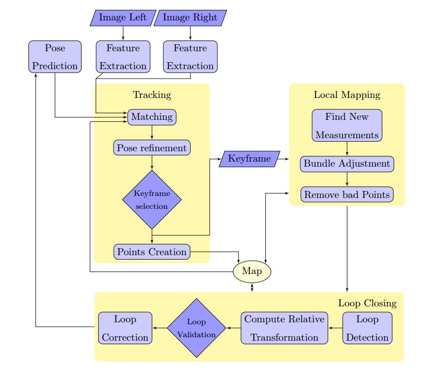
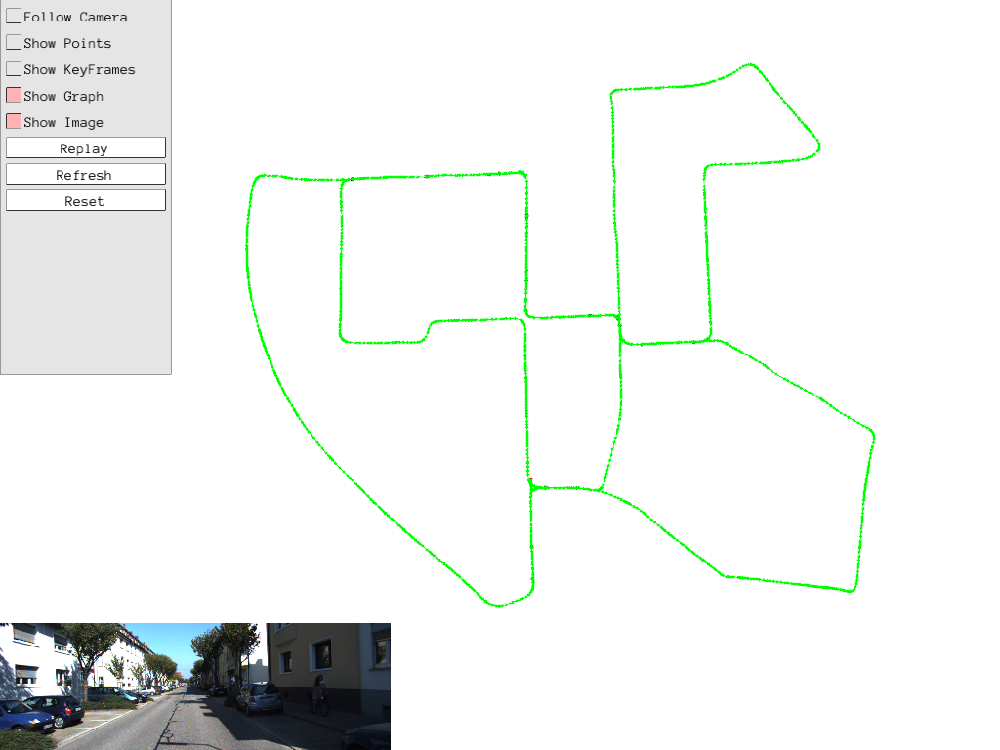
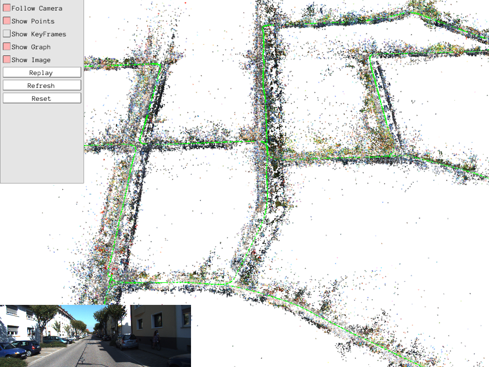

# stereo_ptam

This python project is a complete implementation of Stereo PTAM, based on C++ project [lrse/sptam](https://github.com/lrse/sptam) and paper "[S-PTAM: Stereo Parallel Tracking and Mapping](http://webdiis.unizar.es/~jcivera/papers/pire_etal_ras17.pdf) Taihu Pire et al. RAS17", with some modifications.   

> S-PTAM is a Stereo SLAM system able to compute the camera trajectory in real-time. It heavily exploits the parallel nature of the SLAM problem, separating the time-constrained pose estimation from less pressing matters such as map building and refinement tasks. On the other hand, the stereo setting allows to reconstruct a metric 3D map for each frame of stereo images, improving the accuracy of the mapping process with respect to monocular SLAM and avoiding the well-known bootstrapping problem. Also, the real scale of the environment is an essential feature for robots which have to interact with their surrounding workspace.   

S-PTAM system overview (from [S-PTAM paper](http://webdiis.unizar.es/~jcivera/papers/pire_etal_ras17.pdf) page 11):  

As stated in the [S-PTAM paper](http://webdiis.unizar.es/~jcivera/papers/pire_etal_ras17.pdf) (page 39), S-PTAM's results on KITTI dataset is comparable to stereo version of [ORB-SLAM2](https://github.com/raulmur/ORB_SLAM2), and better than stereo LSD-SLAM. It's very inspiring, I'm trying to reproduce the results.

## Features 
(of this implementation)
* Multithreads Tracking, Mapping, and Loop Closing;
* Covisibility Graph (representing the relation between keyframes, mappoints and measurements);
* Local Bundle Adjustment and Pose Graph Optimization;
* Motion Model (used for pose prediction, then for reliable feature matching);
* Point Clouds and Graph visualization;
* Data loader for datasets [KITTI Odometry](http://www.cvlibs.net/datasets/kitti/eval_odometry.php) and [EuRoC MAV](http://projects.asl.ethz.ch/datasets/doku.php?id=kmavvisualinertialdatasets);
* Reasonable speed: ~50ms per frame on EuRoC, and ~70ms per frame on KITTI.

## Requirements
* Python 3.6+
* numpy
* cv2
* [g2o](https://github.com/uoip/g2opy) (python binding of C++ library [g2o](https://github.com/RainerKuemmerle/g2o)) for optimization
* [pangolin](https://github.com/uoip/pangolin) (python binding of C++ library [Pangolin](http://github.com/stevenlovegrove/Pangolin)) for visualization

## Usage
`python sptam.py --dataset kitti --path path/to/your/KITTI_odometry_dataset/sequences/00`  
or  
`python sptam.py --dataset euroc --path path/to/your/EuRoC_MAV_dataset/MH_01_easy`

## Results
Visual results (screenshots from my experiment) on KITTI odometry sequence 00:   
* graph:  
As shown below, all loops have been closed (loop points are marked in black).   
   
* point cloud:   

### TODO:
Exhaustive evaluation on datasets. (There seems to be a python package [MichaelGrupp/evo](https://github.com/MichaelGrupp/evo) for odometry/SLAM algorithm evaluation)

## License
This python reimplementation is largely based on [sptam](https://github.com/lrse/sptam), so it's licensed under GPLv3 License. 

## Contact
If you have problems related to the base S-PTAM algorithm, you can contact original authors [lrse](https://github.com/lrse) (robotica@dc.uba.ar), or refer to the related papers:  
[1]  Taihú Pire,Thomas Fischer, Gastón Castro, Pablo De Cristóforis, Javier Civera and Julio Jacobo Berlles.
**S-PTAM: Stereo Parallel Tracking and Mapping**
Robotics and Autonomous Systems, 2017.  

[2] Taihú Pire, Thomas Fischer, Javier Civera, Pablo De Cristóforis and Julio Jacobo Berlles.  
**Stereo Parallel Tracking and Mapping for Robot Localization**  
Proc. of The International Conference on Intelligent Robots and Systems (IROS), Hamburg, Germany, 2015.  

If you have interest in the python implementation here, just email me (Hang Qi, qihang@outlook.com);
